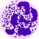

# hematologicCount 

A hematologic count with reticulocytes function, relactive count ant platelets count. 

#ptBr
A ideia inicial deste aplicativo é criar um contador hematologico que realize a contagem relativa, quando a contagem relativa terminar oferecer a lista dosleucocitos relativos contados. Além disso como ideia inicial quero:

<ol>
  <li> 1.Adicionar um contador de reticulócitos </li>
  <ul> 1.1 - que tenha contagem de campos e reticulcitos </ul>
  <ul>  1.2 - que faça contagens e calculo dos reticulocitos a partir do eritrograma que deve ser inserido em inputs </ul>
  <ul>  1.3 - que tenha a função deresultado parcial e de zerar a contagem atual </ul>
  <li> 2.Adicionar um corretor de eritroblastos </li>
  <ul>2.1 - que tenha a contagem de eritroblastos paralela a contagem relativa </ul>
  <ul>2.2 - que contenha celulas precursoras em sua contagem, alem dos linfocitos atipicos </ul>
  <ul>2.3 - que mostre o resultado apos o final da contagem </ul>
  <ul>  1.3 - que tenha a função deresultado parcial e de zerar a contagem atual </ul>
  <li>3.Adicionar um contador de plaquetas</li>
  <ul>3.1 - que mostre mais de uma metodologia de contagem (ex. Fônio e O'Neil)  </ul> 
  <ul>3.2 - que realize o calculo de plaquetas  </ul> 
  </ol>
