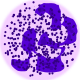

# hematologicCount 
 
Status: In progress 🛠️
##### A body cells counter
🇺🇸/🇬🇧  
The counter's intention is to create an interface that integrates various laboratory counters in one place, that works on desktop and mobile devices directly from the browser, and that is practical and easy to use. Currently, the project is still under development and already includes a differential counter, a reticulocyte counter, a cell counter in noble fluids, and a cell counter in urine for microscopy. For the inicial necessities I decided take the count in PT-BR.  
  
🇧🇷/🇵🇹  
A intenção do contador é criar uma interface que integre diversos contadores utilizados em laboratório em um unico lugar, que funcione em desktop e celular diretamente do navegador, que seja algo prático e fácil de usar. No momento o projeto ainda está em desenvolvimento e já conta com um contador diferencial, contador de reticulócitos, de células em líquidos nobres e de células em urina para exame de sedmentoscopia.  

<a href="https://davesilveira.github.io/hematologicCount/" target="_blank">Click here to see how the project is going.</a>
